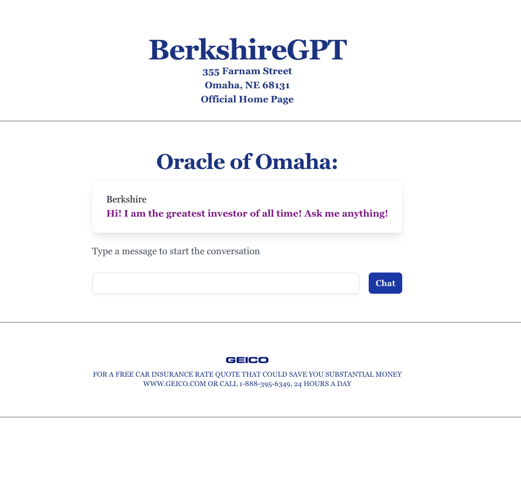

# BerkshireGPT

BerkshireGPT a simple chat bot using Next.js, API Routes, and [OpenAI ChatGPT API](https://beta.openai.com/docs/api-reference/completions/create).



### Components

- Next.js
- OpenAI API (ChatGPT) - streaming
- API Routes (Edge runtime) - streaming

## How to Use

You can choose from one of the following two methods to use this repository:

### One-Click Deploy

Deploy the example using [Vercel](https://vercel.com?utm_source=github&utm_medium=readme&utm_campaign=vercel-examples):

[](https://vercel.com/new/clone?repository-url=https://github.com/vercel/examples/tree/main/solutions/ai-chatgpt&project-name=ai-chatgpt&repository-name=ai-chatgpt&env=OPENAI_API_KEY)

### Clone and Deploy

Execute [`create-next-app`](https://github.com/vercel/next.js/tree/canary/packages/create-next-app) with [pnpm](https://pnpm.io/installation) to bootstrap the example:

```bash
pnpm create next-app --example https://github.com/vercel/examples/tree/main/solutions/ai-chatgpt
```

#### Set up environment variables

Rename [`.env.example`](.env.example) to `.env.local`:

```bash
cp .env.example .env.local
```

then, update `OPENAI_API_KEY` with your [OpenAI](https://beta.openai.com/account/api-keys) secret key.

Next, run Next.js in development mode:

```bash
pnpm dev
```

The app should be up and running at http://localhost:3000.

Deploy it to the cloud with [Vercel](https://vercel.com/new?utm_source=github&utm_medium=readme&utm_campaign=edge-middleware-eap) ([Documentation](https://nextjs.org/docs/deployment)).
